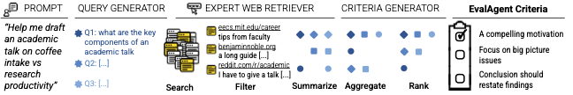

# EvalAgent

EvalAgent is a framework for extracting evaluation criteria from instructional web documents. It consists of several components that work together to generate grounded evaluation criteria.
At a high level, given a user prompt:
1. We generate search queries based on the prompt.
2. Retrieve relevant instructional web documents.
3. Generate answers to the queries.
4. Aggregate these answers into evaluation criteria grounded in instructional content.





## 🛠️ Installation 
First, install the required dependencies:

`
pip install -r requirements.txt
`

Then, set up the necessary API keys and environment variables:
1. **Model API keys** — for query generation, answering, and criteria aggregation. 
2. **Search API credentials** — to retrieve web documents.

> 🔧 Our search is backed by Google Search API. The set up instructions can be found [here](https://github.com/ManyaWadhwa/EvalAgent/blob/main/google_setup.md).

> 📘 **Optional - Reddit Setup:**
> Some queries may return Reddit URLs. If you'd like to scrape Reddit content, set up praw by following the [Reddit setup guide](https://github.com/ManyaWadhwa/EvalAgent/blob/main/reddit_setup.md). This is optional—if not configured, Reddit URLs will simply be skipped without errors.


### 🔐 Environment variables
Create and populate a file named `environment_variables.sh` with the following:

```
## OpenAI if you using their models; else set up anthropic keys if needed
export OPENAI_API_KEY=
## Google search credentials 
export GOOGLE_SEARCH_API_KEY=
export CSE_ID=
## OPTIONAL reddit credentials
export reddit_client_id=
export reddit_client_secret=
export reddit_user_agent=
export reddit_username=
export reddit_password=
```

## 🚀  Running EvalAgent

EvalAgent generates evaluation criteria using two complementary sources:

(1) LLM-_n_: generated directly via prompting an LLM (n criteria).

(2) EA-Web: extracted from instructional web documents through retrieval and aggregation.

These are then combined to produce the final output: **EA-Full** — a combined set of evaluation criteria sorted by their relevance to the user-prompt. 

To generate **EA-Full**, set up your config file (`criteria_gen_args.yaml`) like so:
```
input_file: "data/sample.jsonl"
output_file: "data/sample_criteria.jsonl"
ea: true 
llm: true
search: true
score: true
query_model: gpt-4o-mini-2024-07-18
aggregator_model: gpt-4o-mini-2024-07-18
answer_model: gpt-4o-mini-2024-07-18
scoring_model: gpt-4o-mini-2024-07-18
n: 10 
```

Then source your environment variables and run:
```
./environment_variables.sh
python evaluation_criteria_generator.py --config criteria_gen_args.yaml
```

The output file will contain three types of criteria:
1. _llm_criteria_ : LLM prompted criteria that generates _n_ criteria 
2. _ea_criteria_: EA-Web criteria generated from instructional web documents 
3. _ea_full_criteria_: merged criteria that combines LLM and EA-Web 

## 📊 Evaluating with EvalAgent 

EvalAgent can also evaluate model responses using the generated criteria.
First, create an evaluation config (`evaluation_args.yaml`):

```
input_file: "data/sample_with_responses.jsonl"
output_file: "data/sample_test_evaluation.jsonl"
generate_criteria: true
criteria_generator_config: "criteria_gen_args.yaml"
criteria_column: "ea_criteria"
evaluation_model: gpt-4o-mini-2024-07-18
```

Ensure your `criteria_gen_args.yaml` is configured as described above. Then run:
```
python evaluate.py --config evaluation_args.yaml
```

You may use any of the three generated criteria types (_llm_criteria_, _ea_criteria_, or _ea_full_criteria_) in the evaluation.

## ⚙️  Alternate modes for criteria gen with EvalAgent

You can flexibly run EvalAgent criteria generation in different modes depending on your needs:

### 🔹LLM-_n_
Only generating LLM prompted criteria
```
ea: false
llm: true
search: false
score: false
n: 10 
```

### 🔹 EvalAgent-LLM (LLM-generated answers to queries, no search):
```
ea: true
llm: false
search: false
score: false
```

### 🔹 EvalAgent-Web (search + document-based)
```
ea: true
llm: false
search: true
score: false
```

In all cases, the rest of the config (models, n, input/output files) remains the same.


## 🖥️ Visualization 

EvalAgent includes a Flask-based UI to visualize criteria generated via search.
```
cd data/
python app.py --data ../data/sample_data_criteria_search.jsonl
```