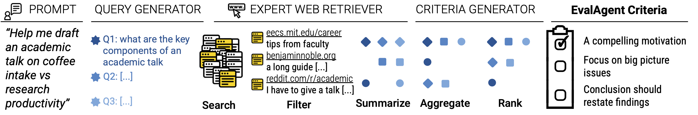

# EvalAgent

We propose **EvalAgent**, aimed at extracting evaluation criteria from instructional web documents. Our framework comprises several key components. At a high level, given a user promopt, we first generate search queries that can be easily answered using instructional web documents. After retrieving such documents, we generate answers for the search queries. We then combine these answers to generate an evaluation criteria that is grounded in instructional documents.



The figure above gives an overview of our framework. 
1. Step 1: Query Generation 
2. Step 2: Expert Web Retriever 
3. Step 3: Criteria Generator 

## 🛠️ Installation 
Python environment set up:

`
pip install -r requirements.txt
`

After setting the environment, we need to set a few keys/environment variables to do the following:
1. Model API keys you want to use for running query generation, answering and criteria aggregation 
2. Search set up - for retrieving URLs

Our search is backed by Google Search API. The set up instructions can be found [here](https://github.com/ManyaWadhwa/EvalAgent/blob/main/google_setup.md).

[optional set up] 
Reddit URLs are often retrieved by our search queries, so we use `praw` to scrap we also set up reddit scraping. You can find the setup instructions [here](https://github.com/ManyaWadhwa/EvalAgent/blob/main/reddit_setup.md). This setup is optional, if the environment variables are not setup you won't get an error, we just won't include that URL.

### Environment variables
Once you have gone through the set up above make sure you have the following variables populated in `environment_variables.sh`
```
## OpenAI if you using their models; else set up anthropic keys if needed
export OPENAI_API_KEY=
## Google search credentials 
export GOOGLE_SEARCH_API_KEY=
export CSE_ID=
## OPTIONAL reddit credentials
export reddit_client_id=
export reddit_client_secret=
export reddit_user_agent=
export reddit_username=
export reddit_password=
```

## Running EvalAgent

Our proposed method can be run in two setups:
1. without search: EA-LLM 
2. with search: EA-Web (proposed system in the paper)


To run EA-LLM:

```
./environment_variables.sh
python run_ea_criteria.py --input_file data/sample.jsonl --output_file data/sample_data_criteria_llm.jsonl 
```

To run EA-web criteria generation:
```
./environment_variables.sh
python run_ea_criteria.py --input_file data/sample.jsonl --output_file data/sample_data_criteria_search.jsonl --search
```

Default `query_model`, `aggregator_model` and `answer_model` is set to be: `gpt-4o-mini-2024-07-18`.

## EA-Full 
TBA

## Visualization 

We also have a flask-based UI where you can load the jsonl output from the search-based criteria generation. You can load the UI with the following command:
```
cd data/
python app.py --data ../data/sample_data_criteria_search.jsonl
```